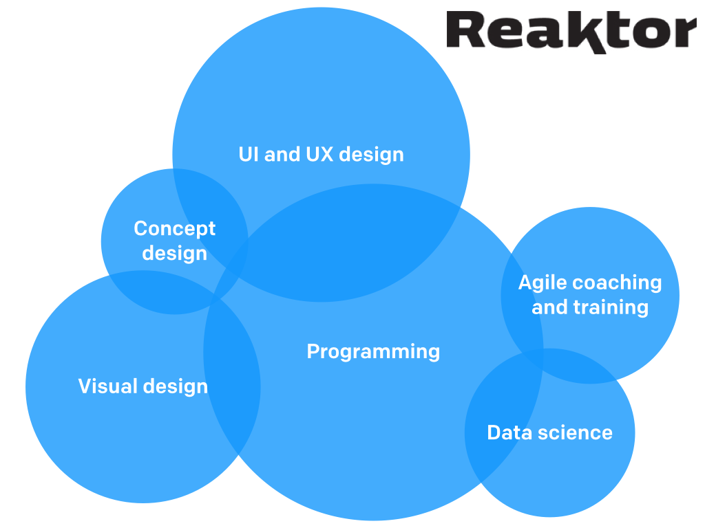

## Challenges with (big) data

<div class="columns-2">

More data means more complexity.

Data points have dependencies and hierarchies.

Data is noisy and partly missing.

**Conclusions based on raw data are often misleading.**

<center>

</center>

</div>


## Probabilistic modeling

Helps in handling missing data, uncertainty and dependencies.

Example: Model of regional apartment prices in Finland

<center>

</center>


## Probabilistic modeling (2)

Makes interesting and reliable findings possible.

Example: Clear urbanisation trend visible

<center>

</center>

## Probabilistic programming

Automated inference for probabilistic models

* problem $\rightarrow$ model $\rightarrow$ inference $\rightarrow$ results
* [STAN](http://mc-stan.org/index.html) for full Bayesian statistical inference

```{r, eval=FALSE}
model {
    y ~ normal(x, sigma);
    x ~ normal(0, 2);
    sigma ~ uniform(0, 10);
}
```


* rapid iterative model development
* towards big data applications with efficient approximative solutions


## Conclusions

Big data needs big modelling.

Flexible modelling tools available, such as [STAN](http://mc-stan.org/index.html).

<br>

<div class="columns-2">

<article class="smaller">
See more at

* [Reaktor Data Science](http://reaktor.com/datascience)
* [Kannattaakokauppa.fi](http://kannattaakokauppa.fi/#/en/) with  
[technical description](http://ropengov.github.io/r/2015/06/11/apartment-prices/) and  
[source code](https://github.com/reaktor/Neliohinnat)
* [Slides online](http://ouzor.github.io/presentations/iccss_2015/iccss_reaktor_2015.html) and [rmarkdown source](https://raw.githubusercontent.com/ouzor/ouzor.github.com/master/presentations/iccss_2015/iccss_reaktor_2015.Rmd)

</article>

<center>

</center>

</div>


